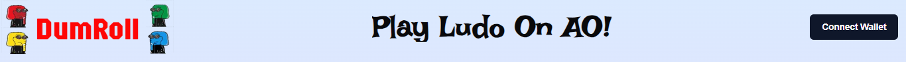
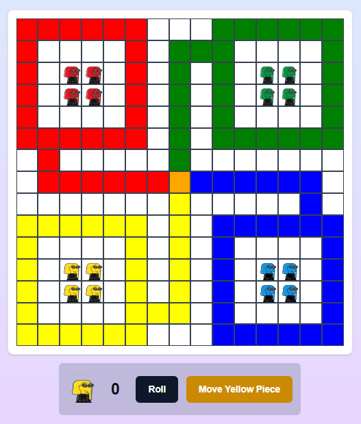
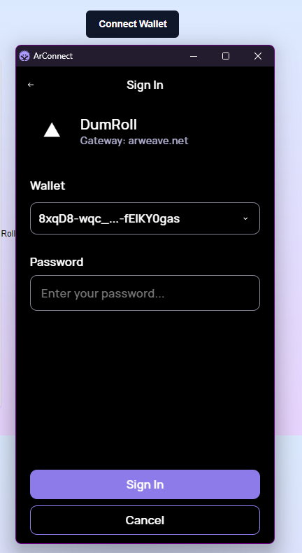

Here's a sample README for **DumRoll: Decentralized Ludo on Arweave**, complete with a structure to add images once you have them.

---

# DumRoll 🕹️

**Ludo Chain** is a decentralized, Web3-powered version of the classic Ludo board game. Built on Arweave's permaweb, it offers a secure, permanent, and trustless gaming experience. Featuring real-time multiplayer interactions through **aoConnect** and verifiable dice rolls, this dApp brings traditional board gaming into the blockchain era.



## 🚀 Features

- **Secure Player Authentication**: Log in seamlessly using **arweaveWallet** for a secure and decentralized experience.
- **Real-Time Multiplayer**: Connect with friends and opponents in real time using **aoConnect**.
- **Verifiable Dice Rolls**: Ensure fair gameplay with Lua-script-powered random dice rolls.
- **Smart Contract-Based Rules**: Game rules are enforced via **Ao-Process**, ensuring transparent and trustless interactions.
- **Permanent Game History**: Game states are stored on Arweave's permaweb, enabling permanent storage of moves and outcomes.

## 🎮 Demo

Check out the live demo [here](https://dum-roll.vercel.app/).



## 🛠️ Tech Stack

| Component      | Technology        |
|----------------|-------------------|
| **Frontend**   | Next.js, TypeScript|
| **Blockchain** | Arweave           |
| **Authentication** | arweaveWallet |
| **Connection** | aoConnect       |
| **Smart Contracts** | Ao-Process    |

## 📸 Screenshots

### 1. Home Screen
The starting point of the game where users can connect their wallets and join or create a room.


### 2. Gameplay Screen
Experience the classic Ludo game with a decentralized twist.


### 3. Player Authentication
Secure login using **arweaveWallet** ensures privacy and control.



## 📦 Installation

Follow these steps to get the project up and running locally:

1. **Clone the Repository:**
   ```bash
   git clone https://github.com/yourusername/DumRoll.git
   cd DumRoll
   ```

2. **Install Dependencies:**
   ```bash
   npm install
   ```

3. **Run the Development Server:**
   ```bash
   npm run dev
   ```

4. **Open in Browser:**
   Navigate to `http://localhost:3000` to start playing.

## ⚙️ How It Works

1. **Player Authentication**: Users log in using **arweaveWallet**, which securely manages their session.
2. **Room Creation and Joining**: Players can create a new game room or join an existing one in real time using **aoConnect**.
3. **Smart Contract Logic**: Game rules and mechanics are handled through smart contracts on Ao-Process, ensuring a fair experience.
4. **Random Dice Rolls**: Lua scripts are used to generate verifiable, random dice rolls, adding a layer of trust to the gameplay.

## 🌐 Roadmap

- **Expand Dice Roll Verification**: Utilize Arweave's data transactions to store and verify dice rolls permanently.
- **Mobile Version**: Improve mobile compatibility for seamless gameplay on all devices.
- **Enhanced Analytics**: Track game statistics and player performance using a decentralized analytics solution.

## 🤝 Contributing

We welcome contributions from the community! To get started:

1. Fork the repository.
2. Create a new branch (`feature/your-feature`).
3. Commit your changes (`git commit -m 'Add a new feature'`).
4. Push to the branch (`git push origin feature/your-feature`).
5. Open a pull request.

## 📄 License

This project is licensed under the MIT License - see the [LICENSE](./LICENSE) file for details.

## 💬 Feedback

If you have any feedback or suggestions, feel free to open an issue or reach out to us directly.

---

### 📧 Contact

- **Email**: [your-email@example.com](mailto:your-email@example.com)
- **Twitter**: [@yourusername](https://twitter.com/yourusername)

Enjoy the game and dive into decentralized board gaming with **DumRoll**! 🥳

---
